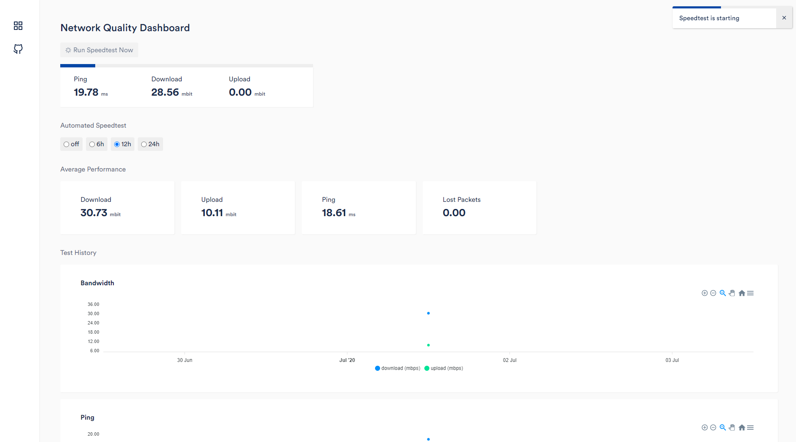

# ISP SpeedTest Logger


If you're on a LTE, 4G, 5G, ... connection, and want to review how (💩) it holds up over time, this should do the trick for you.
This webapp allows you to periodically run speedtests (node.js), store the results (mongodb), and review your network quality in a web ui.

> You can for example throw this container-set on a raspberry pi with docker-host, and leave it running.

## Features

- Review Network performance over time in UI
- Configure automated speedtests to run every 24/12/6 hours
- Easily deploy and run through docker



## Requirements 📦

- node v12
- docker + docker-compose installed
- host machine should have internet access

### docker-compose

Run `docker-compose up -d` to build and start all docker containers (db, client, server). It will also automatically build client and server on the first startup.

**Client** is available on http://localhost:3000

**Server** is available on http://localhost:3001 and you can checkout the **swagger docs** on http://localhost:3001/api-docs

### 💻 Development

> Make sure you run node v12, as i havent updated the repo to run on newer node versions. PR welcome

> Admin pw can be set in `.env` -> `ADMIN_PW`

During development you might want to run mongodb via docker, but run the api / frontend locally.

```bash
docker run -d \
  --name isp-mongodb \
  --publish 27017:27017 \
  mongo
```

Install dependencies first with `npm install`, both in server and client.

Setup `./server/.env` by copying the `./server/example.env` file.

You can then run `npm start`, in both server and client to start the application in dev mode.

**Client** is available on http://localhost:3000

**Server** is available on http://localhost:3001 and you can checkout the **swagger docs** on http://localhost:3001/api-docs

<a href="https://www.buymeacoffee.com/aspieslechner" target="_blank"></a>
